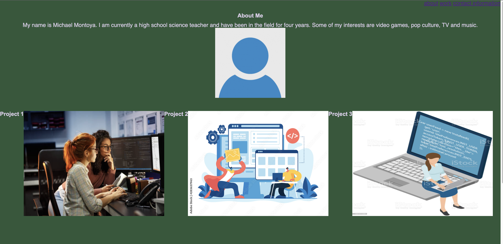

# Module 2 challenge: MichaelCSS Portfolio

## Description

This project contains My name, an avatar photo, an about me, contact information and stock photos of future projects or "work" that can be linked late.

The links of the navigation bar makes the UI scroll to their specific sections.

Images for the projects grow when they are hovered.

The contents of the page have a responsive layout that adapts the view when the window is smaller.

## Screen shot

### link

https://github.com/mmontoya1112/MichaelCSS

